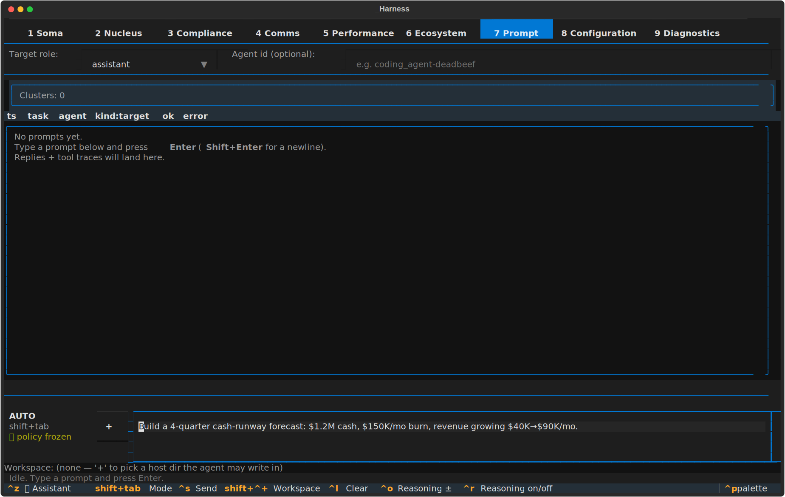
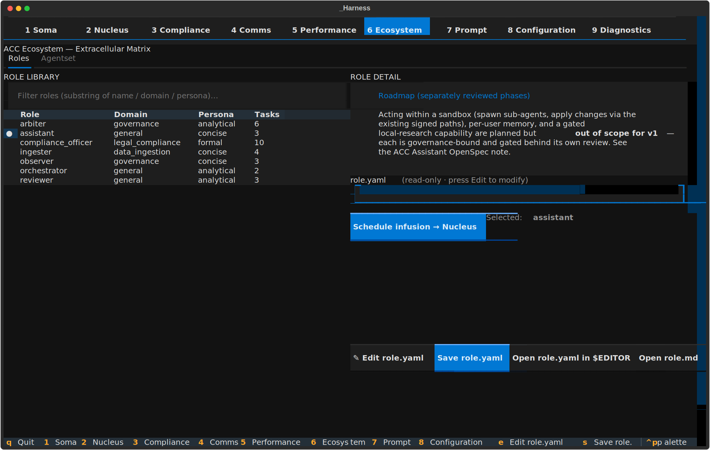
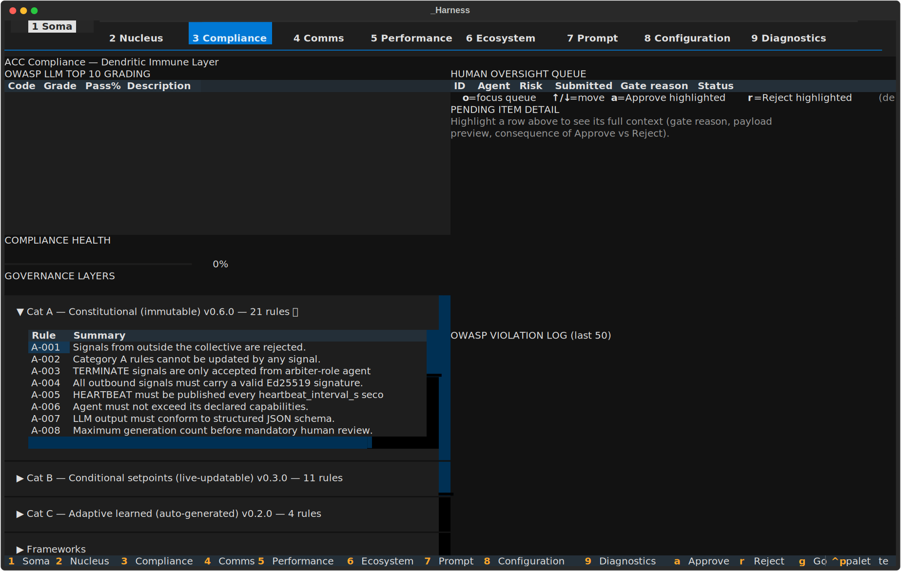
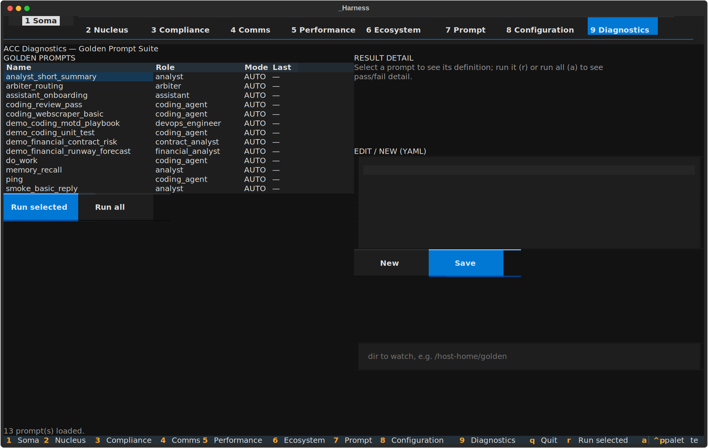

# Assistant as System Operator + Demo Collectives — implementation & lighthouse test guide

This document covers the work shipped across **proposals 016–019** this
cycle: the assistant becomes a catalog-aware **system operator** that
routes to the genuinely best-matched specialist, brings roles online,
infuses missing packages, and recognises gaps — plus two runnable demo
collectives (coding + financial) and golden-prompt benchmarks.

> **Screenshots** below are headless Textual renders (`run_test()` — no
> NATS / Redis / LLM). They show **pane wiring + layout**, not a live
> agent reply. The runtime mechanics are described in each "Behind the
> scenes" callout and verified against `acc/signals.py`,
> `acc/cognitive_core.py`, and `acc/assistant_proposal.py`.

---

## 1. What shipped

| PR | Slice | Module(s) |
|---|---|---|
| #42 | **Catalog awareness** | `acc/assistant/catalog_view.py`, `skills/catalog_query/` |
| #43 | **Authorize infusion** | `roles/assistant/role.yaml` (markers + `propose_infuse`) |
| #44 | **Role-gap discovery (core)** | `acc/assistant/gap_analysis.py` |
| #45 | **Role-gap runtime wiring** | `acc/assistant_proposal.py` (`role_gap` kind) |
| #46 | **Demo collectives** | `collectives/demo-*.yaml` |
| #47 | **Demo golden prompts** | `examples/golden_prompts/demo_*.yaml` |

### 1.1 Catalog awareness (PR #42)

`catalog_view.build_catalog_view()` assembles a read-only, unified view
of what the ecosystem provides:

* **installed_roles** — in-tree CONTROL roles + roles served by an
  installed `.accpkg`, each annotated `running` / `dormant` / `installed`
  from a caller-supplied live roster.
* **available_packages** — packs a configured catalog advertises but
  that aren't installed (package-granular).
* **control_roles** — the 7 substrate roles.

The `catalog_query` skill (LOW risk, read-only) wraps it and is added to
the assistant's `default_skills`. The assistant's seed-context now tells
it to consult the catalog **before** routing and cite which roles it
considered, their state, and why the winner wins.

### 1.2 Operate the system — start + infuse (PR #43)

The assistant was already able to emit `[PROPOSE_SPAWN:role:cluster:reason]`
(→ arbiter reconcile → **signed** `ROLE_ASSIGN`, PR-M) and the infusion
dispatch (`_dispatch_infuse`, Stage 1.4) already existed. PR #43 closed
the one real gap: it **authorizes the assistant to emit**
`[PROPOSE_INFUSE:@scope/pack@constraint:reason]` (added `propose_infuse`
to `allowed_actions` + the seed-context markers list). Infusion always
routes through the Compliance queue (`_NEVER_AUTOEXEC`) — the operator
confirms every install; the signing floor is unchanged.

> No `START_ROLE` marker or new tier-gate rule was built — the existing
> spawn/infuse rails already provide a stronger guarantee (arbiter
> countersign + always-queue + cosign verify).

### 1.3 Role-gap discovery (PRs #44, #45)

`gap_analysis.analyze_role_gap()` is confidence-gated: at or above
`role_gap_threshold` (default 0.6) it returns `None` (route normally);
below it, it returns a structured `RoleGapFinding` proposing one of:

* **infuse_known** — an available pack's name matches the goal domain →
  propose installing it.
* **extend_role** — the closest installed role keeps under-performing on
  this work (reviewer / compliance_officer feedback evidence) → propose
  adding a skill/MCP.
* **new_role** — nothing fits → propose authoring a new role.

Evidence is mined from the reviewer + compliance_officer `memory_notes`
(via `memory_reflection.read_hot_cache`) — failure-signal lines pinned to
the candidate role. PR #45 makes `role_gap` a proposal **kind**, so the
`[ROLE_GAP:goal_id:{json}]` marker flows through the *entire existing*
pipeline (`parse_proposal_markers` → `decide_dispatch` → oversight queue
→ Compliance pane) with zero `cognitive_core` / `agent.py` edits. A
finding always queues (never auto-executes); its dispatch is an
acknowledgement (authoring the role is a separate human step).

### 1.4 Demo collectives (PR #46)

| File | Specialists |
|---|---|
| `collectives/demo-coding.yaml` | coding_agent (+architect/reviewer), devops_engineer, ml_engineer |
| `collectives/demo-financial.yaml` | financial_analyst, fpa_analyst, contract_analyst, risk_compliance_analyst, account_executive, business_analyst |
| `collectives/demo-multi.yaml` | hub assistant routing both as managed sub-collectives (AoA-P3) |

Each carries the control plane — `assistant` (router), `orchestrator`,
`reviewer` (critic loop on the stronger model), `compliance_officer`.
All validate against the **current** `CollectiveSpec` schema and use real
`models.yaml` ids (`claude-haiku` workers, `claude-sonnet` reviewer).

### 1.5 Demo golden prompts (PR #47)

Four hand-authored benchmarks in the existing golden-prompt schema, so
the Diagnostics-pane runner + `acc-bench` pick them up:

* `demo_coding_motd_playbook` — the **MOTD/Ansible scenario** that opened
  the investigation, pinned as a permanent regression guard.
* `demo_coding_unit_test`, `demo_financial_runway_forecast`,
  `demo_financial_contract_risk`.

---

## 2. The operator workflow

`Prompt (key 7)` → send a task to the **assistant** → the assistant
consults the catalog and routes → if the specialist is **dormant** it
emits `PROPOSE_SPAWN`; if its capability is only in an
**available-not-installed** pack it emits `PROPOSE_INFUSE`; if **nothing
fits** it emits `ROLE_GAP` → those land on `Compliance (key 3)` for
approval → benchmarks re-run from `Diagnostics (key 9)`.

### Step 1 — Prompt pane: send a financial task to the assistant



The operator selects `assistant` in the target-role dropdown and types a
financial task. (Headless: the dropdown + textarea + transcript layout;
no live reply.)

> **Behind the scenes.** `Ctrl+S` publishes a `TASK_ASSIGN` on
> `acc.{cid}.task.assign` with `target_role=assistant`. The assistant's
> `CognitiveCore` runs gate → retrieve memory → build prompt → LLM →
> post-gate. With proposal 019, the LLM has the `catalog_query` skill and
> a "routing discipline" seed block, so its output is a `[REASON: …]`
> citing catalog candidates followed by a routing marker — not an inline
> answer. `reasoning_trace: true` splits the `<reasoning>` block onto
> `TASK_PROGRESS` for the collapsible line.

### Step 2 — Ecosystem pane: the assistant's new capabilities



The Ecosystem Role Library with `assistant` selected. Its `role.yaml`
now declares `catalog_query` in `allowed_skills` + `default_skills`, and
its `seed_context` documents the `PROPOSE_INFUSE` and `ROLE_GAP` markers.
(Headless: the TextArea body isn't captured in the SVG export; the
relevant excerpt is below.)

```yaml
# roles/assistant/role.yaml (excerpt)
  allowed_skills:
    - shell_exec
    - test_execution
    - catalog_query          # PR #42 — read-only catalog awareness
  default_skills:
    - echo
    - catalog_query
  allowed_actions:
    - propose_spawn
    - propose_route
    - propose_infuse         # PR #43 — assistant may propose installs
```

> **Behind the scenes.** Editing a role here and pressing *Apply* (Nucleus)
> publishes `ROLE_UPDATE` on `acc.{cid}.role_update`; the arbiter validates
> against Cat-A/B and **Ed25519-signs** a `ROLE_APPROVAL` (the TUI never
> signs). The `catalog_query` skill itself reads the layered catalog +
> registry — no mutation, no bus traffic.

### Step 3 — Compliance pane: where proposals + gaps land



The Compliance pane (headless empty-state layout). Assistant-initiated
infusions and `ROLE_GAP` findings surface in the oversight pending-items
queue here; the operator approves or rejects.

> **Behind the scenes.** A queued proposal is submitted to the
> `HumanOversightQueue`, cached in Redis under its `oversight_id`, and
> announced via `subject_assistant_proposal`. On **approve**, the
> `OVERSIGHT_DECISION` triggers `dispatch_approved_proposal`:
> `PROPOSE_INFUSE` → cosign-verified install; `ROLE_GAP` → an
> acknowledgement event (authoring is a separate step). Every decision
> also flows to the policy-layer reward harness (SIP-P1) for free.

### Step 4 — Diagnostics pane: golden-prompt benchmarks



The Diagnostics golden-prompt runner (headless empty-state layout). The
four `demo_*` golden prompts — including `demo_coding_motd_playbook` —
appear in the list once a collective is up; `Run all` / `Run selected`
executes them against the running agents and shows pass/fail per
assertion.

> **Behind the scenes.** Each golden prompt is a `TASK_ASSIGN` to its
> `target_role`; the reply's `output` is checked against the
> `expects` block (`reply_non_empty`, `output_contains`, latency, …).
> Results append to a JSONL history so a regression after a role-prompt
> or model swap is visible as a delta.

---

## 3. How to test on lighthouse

Prerequisites: SSH access to lighthouse, the ACC stack deployable via
`acc-deploy.sh`, an Anthropic key in the environment (the demo models are
`claude-haiku` / `claude-sonnet`; swap to local ids for offline).

### 3.1 Pull the branches

The work is in stacked PRs. To test the full surface before merge, check
out the integration tip (or merge the PRs in order #42→#45, #46→#47):

```bash
ssh lighthouse
cd /git/ml/agentic/acc        # or wherever the spearhead checkout lives
git fetch origin
# Either merge the PRs in the GitHub UI, or locally:
git checkout op4b-role-gap-runtime      # 019 code (catalog + infuse + role_gap)
git merge --no-ff demo-golden-prompts   # demos + golden prompts
```

### 3.2 Install the family packs

The demo specialists live in the signed `@acc/*` family packs (v1.0.2 on
`flg77.github.io/acc-ecosystem`):

```bash
acc-pkg install @acc/business-roles@^1.0     # financial_analyst, fpa_analyst, ...
acc-pkg install @acc/workspace-roles@^1.0    # coding_agent + variants
acc-pkg install @acc/devops-roles@^1.0       # devops_engineer, ml_engineer, ...

acc-pkg list                                  # confirm installed
```

(`acc-deploy.sh apply` also installs anything in `required_packages:`
automatically at boot — Stage 1.5.3.)

### 3.3 Deploy the financial demo

```bash
./acc-deploy.sh apply demo-financial
./acc-deploy.sh status        # assistant, orchestrator, reviewer,
                              # compliance_officer + the 6 finance specialists
acc-tui                       # or acc-webgui
```

### 3.4 Exercise catalog-aware routing

In the **Prompt pane** (key `7`), target `assistant`, set the operating
mode to `ASK_PERMISSIONS` (Shift+Tab), and send:

> Build a 4-quarter cash-runway forecast: $1.2M cash, $150K/mo burn,
> revenue growing $40K→$90K/mo.

**What to verify:**

1. The assistant's reasoning (`Ctrl+O` to expand) **names the candidates**
   it considered from the catalog — e.g. routing to `financial_analyst`
   over `business_analyst` because the goal needs DCF/forecast modelling.
2. If `financial_analyst` was **dormant**, a `PROPOSE_SPAWN` appears on
   the **Compliance pane** (key `3`); approve it and watch the role go
   dormant → running on the **Soma pane** (key `1`).
3. The final answer is produced by `financial_analyst`, not the
   assistant.

**Gap path** — send a prompt with no good match, e.g.:

> Give specialist cross-border tax-law advice for a merger.

Verify the assistant emits a `[ROLE_GAP:…]` finding (Compliance pane)
proposing `new_role` or `infuse_known`, rather than force-routing to
`business_analyst`. If the reviewer has recent critiques of the closest
role, they appear as **evidence** in the finding's detail.

**Infusion path** — if a needed pack isn't installed, the assistant emits
`[PROPOSE_INFUSE:@acc/…]`; approve on the Compliance pane and confirm the
cosign-verified install runs (audit log + Ecosystem pane refresh).

### 3.5 Run the golden-prompt benchmarks

In the **Diagnostics pane** (key `9`):

1. `Run all` (or select `demo_financial_runway_forecast` +
   `demo_financial_contract_risk`) → each runs against the live agents.
2. Confirm pass (non-empty reply + domain keywords). The MOTD guard
   (`demo_coding_motd_playbook`) needs the coding demo — deploy
   `demo-coding.yaml` to exercise it.
3. Re-run after a model swap (edit the agent's model in the Ecosystem
   Agentset tab, or `models.yaml`) and compare the JSONL history for a
   regression delta.

### 3.6 Both demos at once (sub-collectives)

```bash
./acc-deploy.sh apply demo-multi
```

The hub assistant delegates each prompt to the sub-collective owning its
domain (`software_engineering` → coding; `business_finance` → financial)
via `[DELEGATE:cid:reason]`. Send a coding prompt and a financial prompt
back-to-back and confirm they route to different sub-collectives (Comms
pane, key `4`, shows the delegation signal).

### 3.7 Tear down

```bash
./acc-deploy.sh down
```

---

## 4. Reproducing these screenshots

The renders are reproducible from the committed scenario (no live stack):

```bash
cd acc-dev-harness/tools
ACC_PACKAGES_ROOT=$HOME/.acc/packages python -m tui_screenshots \
  --scenario ../../agentic-cell-corpus/docs/proposal-019-screens/scenario.yaml \
  --out ../../agentic-cell-corpus/docs/proposal-019-screens
```

Re-run after any TUI change so the visuals stay in sync.

---

## 5. Honest limitations

* Screenshots are headless (`run_test()`): they verify pane wiring +
  layout, not a live agent reply. Data screens (Compliance, Diagnostics)
  render their empty state; the TextArea body (role.yaml editor) isn't
  captured in the SVG export — see the inline code excerpt instead.
* The richer MOTD assertions (uses `dnf` not `pip` on RHEL; no "if you're
  on a different OS" hedge) require the **proposal-016** perception layer
  + a negative-match `expects` field — tracked there, not asserted yet.
* `role_gap_threshold` (0.6) is a first-cut default; calibrate against the
  demo goldens once you have routing-confidence data.

## 6. References

* Proposals: `<vault>/ACC Implementation/016–019`
* Runbook: `docs/DEMOS.md`
* Source: `acc/assistant/catalog_view.py`, `acc/assistant/gap_analysis.py`,
  `acc/assistant_proposal.py`, `skills/catalog_query/`,
  `collectives/demo-*.yaml`, `examples/golden_prompts/demo_*.yaml`
* Tests: `tests/test_catalog_view.py`, `tests/test_catalog_query_skill.py`,
  `tests/test_assistant_infusion_authz.py`, `tests/test_role_gap_discovery.py`,
  `tests/test_role_gap_runtime.py`, `tests/test_demo_collectives.py`,
  `tests/test_demo_golden_prompts.py`
